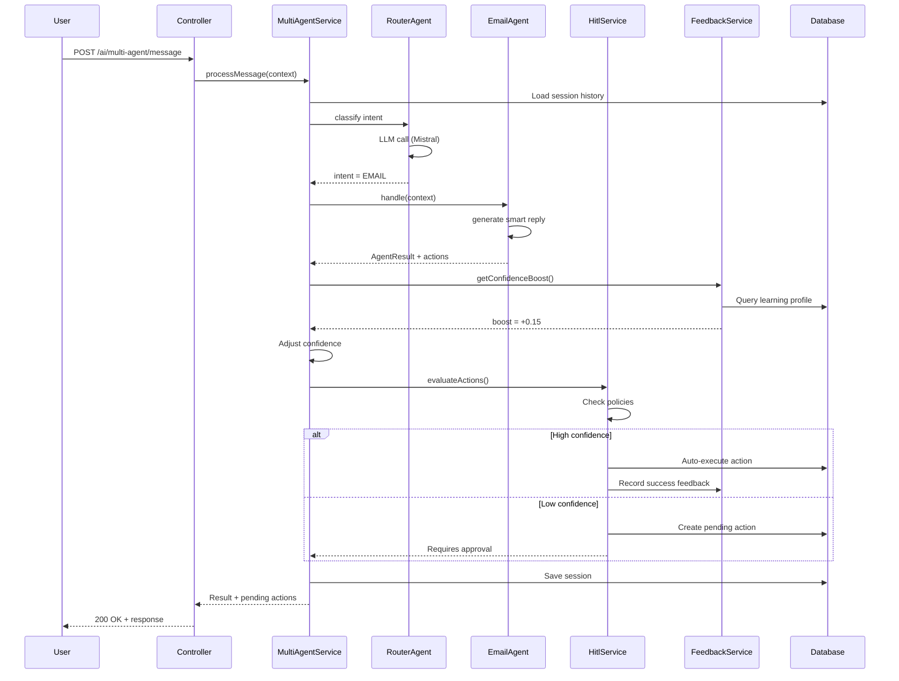
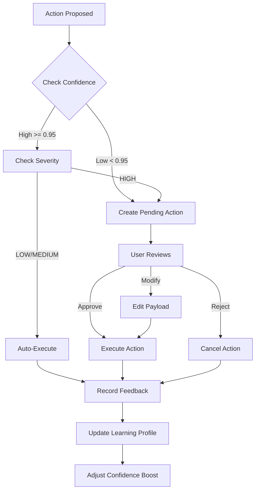

# 🏗️ Architettura Sistema Multi-Agent - Design e Pattern

## 📋 Indice

- [1. Overview Architetturale](#1-overview-architetturale)
- [2. Pattern e Principi](#2-pattern-e-principi)
- [3. Componenti Core](#3-componenti-core)
- [4. Flussi di Dati](#4-flussi-di-dati)
- [5. Database Design](#5-database-design)
- [6. Security Architecture](#6-security-architecture)
- [7. Scalabilità](#7-scalabilità)
- [8. Riferimenti Esterni](#8-riferimenti-esterni)

---

## 1. Overview Architetturale

### 1.1 High-Level Architecture

```
┌─────────────────────────────────────────────────────────────────────┐
│                           CLIENT LAYER                               │
│  ┌────────────┐  ┌────────────┐  ┌────────────┐  ┌──────────────┐  │
│  │   React    │  │  WebSocket │  │   Mobile   │  │  CLI Client  │  │
│  │   SPA      │  │  Gateway   │  │   App      │  │              │  │
│  └────────────┘  └────────────┘  └────────────┘  └──────────────┘  │
└─────────────────────────────────────────────────────────────────────┘
                                │
                        ┌───────┴───────┐
                        │  Load Balancer│
                        │  (nginx/AWS)  │
                        └───────┬───────┘
                                │
┌─────────────────────────────────────────────────────────────────────┐
│                          API GATEWAY LAYER                          │
│  ┌──────────────────────────────────────────────────────────────┐   │
│  │                  NestJS Application                          │   │
│  │  ┌────────────┐  ┌────────────┐  ┌────────────────────────┐  │   │
│  │  │   Guards   │  │Interceptors│  │  Exception Filters     │  │   │
│  │  │  (Auth)    │  │ (Logging)  │  │  (Error Handling)      │  │   │
│  │  └────────────┘  └────────────┘  └────────────────────────┘  │   │
│  └──────────────────────────────────────────────────────────────┘   │
└─────────────────────────────────────────────────────────────────────┘
                                │
┌─────────────────────────────────────────────────────────────────────┐
│                         CONTROLLER LAYER                            │
│  ┌──────────────┐  ┌──────────────┐  ┌──────────────────────────┐   │
│  │MultiAgent    │  │   HITL       │  │     Feedback             │   │
│  │Controller    │  │ Controller   │  │    Controller            │   │
│  └──────────────┘  └──────────────┘  └──────────────────────────┘   │
└─────────────────────────────────────────────────────────────────────┘
                                │
┌─────────────────────────────────────────────────────────────────────┐
│                          SERVICE LAYER                              │
│  ┌──────────────────────────────────────────────────────────────┐   │
│  │            MultiAgentService (Orchestrator)                  │   │
│  │  ┌────────────────────────────────────────────────────────┐  │   │
│  │  │              RouterAgent (Intent Classifier)           │  │   │
│  │  └────────────────────────────────────────────────────────┘  │   │
│  └──────────────────────────────────────────────────────────────┘   │
│           │             │              │             │              │
│  ┌────────▼─────┐ ┌─────▼───────┐ ┌────▼───────┐ ┌───▼──────────┐   │
│  │EmailAgent    │ │CalendarAgent│ │ContactsAgt │ │KnowledgeAgt  │   │
│  │- Smart Reply │ │- Scheduling │ │- Dedup     │ │- RAG Search  │   │
│  │- Compose     │ │- Conflicts  │ │- Enrich    │ │- Semantic    │   │
│  │- Categorize  │ │- Invite     │ │- Merge     │ │- Context     │   │
│  └──────────────┘ └─────────────┘ └────────────┘ └──────────────┘   │
│                             │                                       │
│  ┌──────────────────────────▼──────────────────────────────────┐    │
│  │                    HitlService                              │    │
│  │  - Policy Evaluation    - Approval Workflow                 │    │
│  │  - Confidence Check     - Execution Tracking                │    │
│  └─────────────────────────────────────────────────────────────┘    │
│                             │                                       │
│  ┌──────────────────────────▼──────────────────────────────────┐    │
│  │                  FeedbackService                            │    │
│  │  - Learning Loop        - Confidence Adjustment             │    │
│  │  - Analytics            - Profile Management                │    │
│  └─────────────────────────────────────────────────────────────┘    │
└─────────────────────────────────────────────────────────────────────┘
                                │
┌─────────────────────────────────────────────────────────────────────┐
│                        DATA ACCESS LAYER                            │
│  ┌──────────────────────────────────────────────────────────────┐   │
│  │                    PrismaService                             │   │
│  │  - Connection Pool      - Transaction Manager                │   │
│  │  - Query Builder        - Migration Manager                  │   │
│  └──────────────────────────────────────────────────────────────┘   │
└─────────────────────────────────────────────────────────────────────┘
                                │
┌─────────────────────────────────────────────────────────────────────┐
│                          DATA LAYER                                 │
│  ┌──────────────┐  ┌──────────────┐  ┌──────────────────────────┐   │
│  │ PostgreSQL   │  │    Redis     │  │   S3/MinIO               │   │
│  │ + pgvector   │  │   (Cache)    │  │ (Attachments)            │   │
│  └──────────────┘  └──────────────┘  └──────────────────────────┘   │
└─────────────────────────────────────────────────────────────────────┘
                                │
┌─────────────────────────────────────────────────────────────────────┐
│                       EXTERNAL SERVICES                             │
│  ┌──────────────┐  ┌──────────────┐  ┌──────────────────────────┐   │
│  │  Mistral AI  │  │   IMAP/SMTP  │  │  Google/MS Calendar      │   │
│  │   (LLM)      │  │  Providers   │  │      APIs                │   │
│  └──────────────┘  └──────────────┘  └──────────────────────────┘   │
└─────────────────────────────────────────────────────────────────────┘
```

### 1.2 Architettura Logica

**Riferimenti:**
- [Hexagonal Architecture](https://alistair.cockburn.us/hexagonal-architecture/) - Ports & Adapters pattern
- [Clean Architecture](https://blog.cleancoder.com/uncle-bob/2012/08/13/the-clean-architecture.html) - Uncle Bob
- [Domain-Driven Design](https://martinfowler.com/bliki/DomainDrivenDesign.html) - Martin Fowler

---

## 2. Pattern e Principi

### 2.1 Design Patterns Utilizzati

#### Strategy Pattern - Agenti Specializzati
```typescript
// BaseAgent = Strategy interface
interface BaseAgent {
  canHandle(context: AgentContext): boolean;
  handle(context: AgentContext): Promise<AgentResult>;
}

// Concrete strategies
class EmailAgent implements BaseAgent { /* ... */ }
class CalendarAgent implements BaseAgent { /* ... */ }
class ContactsAgent implements BaseAgent { /* ... */ }

// Context (MultiAgentService)
class MultiAgentService {
  private agents: BaseAgent[];

  async processMessage(context: AgentContext) {
    const agent = this.agents.find(a => a.canHandle(context));
    return agent.handle(context);
  }
}
```

**Vantaggi:**
- ✅ Aggiunta agenti senza modificare codice esistente (Open/Closed)
- ✅ Testing isolato di ogni strategia
- ✅ Cambio runtime della strategia

**Riferimenti:**
- [Strategy Pattern](https://refactoring.guru/design-patterns/strategy) - Refactoring Guru
- [Strategy in TypeScript](https://www.patterns.dev/posts/strategy-pattern) - Patterns.dev

#### Chain of Responsibility - Router Agent
```typescript
class RouterAgent {
  private agents: BaseAgent[];

  async route(context: AgentContext): Promise<BaseAgent> {
    for (const agent of this.agents) {
      if (await agent.canHandle(context)) {
        return agent;
      }
    }
    return this.defaultAgent;
  }
}
```

**Riferimenti:**
- [Chain of Responsibility](https://refactoring.guru/design-patterns/chain-of-responsibility) - Pattern guide

#### Observer Pattern - Feedback System
```typescript
class FeedbackService {
  private observers: FeedbackObserver[] = [];

  async recordFeedback(feedback: ActionFeedback) {
    // ... save feedback
    this.notifyObservers(feedback);
  }

  private notifyObservers(feedback: ActionFeedback) {
    for (const observer of this.observers) {
      observer.onFeedback(feedback);
    }
  }
}

// Observers
class LearningProfileUpdater implements FeedbackObserver {
  onFeedback(feedback: ActionFeedback) {
    // Update learning profile
  }
}

class AnalyticsCollector implements FeedbackObserver {
  onFeedback(feedback: ActionFeedback) {
    // Collect analytics
  }
}
```

**Riferimenti:**
- [Observer Pattern](https://refactoring.guru/design-patterns/observer) - Pattern guide

#### Repository Pattern - Data Access
```typescript
// Prisma = Repository implementation
class AgentActionRepository {
  constructor(private prisma: PrismaService) {}

  async findPendingActions(tenantId: string) {
    return this.prisma.agentPendingAction.findMany({
      where: { tenantId, status: 'PENDING' }
    });
  }

  async updateAction(id: string, data: Partial<AgentPendingAction>) {
    return this.prisma.agentPendingAction.update({
      where: { id },
      data
    });
  }
}
```

**Riferimenti:**
- [Repository Pattern](https://martinfowler.com/eaaCatalog/repository.html) - Martin Fowler
- [Prisma Best Practices](https://www.prisma.io/docs/guides/performance-and-optimization/best-practices) - Prisma docs

### 2.2 SOLID Principles

#### Single Responsibility
```typescript
// ❌ BAD: Classe che fa troppo
class AgentService {
  async processMessage() { /* ... */ }
  async saveToDatabase() { /* ... */ }
  async sendEmail() { /* ... */ }
  async callMistralAPI() { /* ... */ }
}

// ✅ GOOD: Responsabilità separate
class MultiAgentService {
  constructor(
    private agentRegistry: AgentRegistry,
    private hitlService: HitlService,
    private prisma: PrismaService
  ) {}

  async processMessage(context: AgentContext) {
    const agent = this.agentRegistry.findAgent(context);
    const result = await agent.handle(context);
    await this.hitlService.evaluateActions(result.actions);
    return result;
  }
}
```

#### Open/Closed Principle
```typescript
// ✅ Open for extension, closed for modification
abstract class BaseAgent {
  abstract canHandle(context: AgentContext): boolean;
  abstract handle(context: AgentContext): Promise<AgentResult>;
}

// Nuovo agente senza modificare codice esistente
class NotificationAgent extends BaseAgent {
  canHandle(context: AgentContext) {
    return context.userMessage.includes('notif');
  }

  async handle(context: AgentContext) {
    // Implementation
  }
}
```

#### Dependency Inversion
```typescript
// ✅ Dipendenza da interfaccia, non implementazione
interface ILLMProvider {
  generateResponse(prompt: string): Promise<string>;
}

class MistralProvider implements ILLMProvider {
  async generateResponse(prompt: string) {
    // Mistral API call
  }
}

class OpenAIProvider implements ILLMProvider {
  async generateResponse(prompt: string) {
    // OpenAI API call
  }
}

class EmailAgent {
  constructor(private llmProvider: ILLMProvider) {}

  async handle(context: AgentContext) {
    const response = await this.llmProvider.generateResponse(prompt);
    // ...
  }
}
```

**Riferimenti:**
- [SOLID Principles](https://www.digitalocean.com/community/conceptual_articles/s-o-l-i-d-the-first-five-principles-of-object-oriented-design) - DigitalOcean guide
- [SOLID in TypeScript](https://dev.to/ezranbayantemur/solid-principles-with-typescript-examples-3gib) - Dev.to article

---

## 3. Componenti Core

### 3.1 MultiAgentService - Orchestrator

**Responsabilità:**
1. Gestione sessioni conversazionali
2. Routing richieste agli agenti
3. Coordinamento workflow multi-step
4. Integrazione con HITL e Feedback

**Diagramma Sequenza:**
```
User → Controller → MultiAgentService → RouterAgent → SpecializedAgent
                          ↓
                    HitlService
                          ↓
                   FeedbackService
                          ↓
                     PrismaService
```

**Riferimenti:**
- [Orchestration vs Choreography](https://solace.com/blog/microservices-choreography-vs-orchestration/) - Pattern comparison
- [Saga Pattern](https://microservices.io/patterns/data/saga.html) - Distributed transactions

### 3.2 Agent Registry

```typescript
@Injectable()
export class AgentRegistry {
  private agents: Map<string, BaseAgent> = new Map();

  register(agent: BaseAgent) {
    this.agents.set(agent.name, agent);
  }

  findAgent(context: AgentContext): BaseAgent | null {
    for (const [name, agent] of this.agents) {
      if (agent.canHandle(context)) {
        return agent;
      }
    }
    return null;
  }

  getAllAgents(): BaseAgent[] {
    return Array.from(this.agents.values());
  }
}
```

**Riferimenti:**
- [Registry Pattern](https://martinfowler.com/eaaCatalog/registry.html) - Martin Fowler

### 3.3 Event Bus (Futuro)

Per scalabilità, considerare event-driven architecture:

```typescript
// Event types
type AgentEvent =
  | { type: 'AGENT_STARTED'; agentName: string }
  | { type: 'ACTION_PROPOSED'; action: AgentAction }
  | { type: 'ACTION_APPROVED'; actionId: string }
  | { type: 'FEEDBACK_RECORDED'; feedback: ActionFeedback };

// Event bus
class EventBus {
  private handlers: Map<string, EventHandler[]> = new Map();

  subscribe(eventType: string, handler: EventHandler) {
    const handlers = this.handlers.get(eventType) || [];
    handlers.push(handler);
    this.handlers.set(eventType, handlers);
  }

  async publish(event: AgentEvent) {
    const handlers = this.handlers.get(event.type) || [];
    await Promise.all(handlers.map(h => h(event)));
  }
}
```

**Riferimenti:**
- [Event-Driven Architecture](https://aws.amazon.com/event-driven-architecture/) - AWS guide
- [CQRS Pattern](https://martinfowler.com/bliki/CQRS.html) - Martin Fowler

---

## 4. Flussi di Dati

### 4.1 Request Flow - User Message



**Riferimenti:**
- [Sequence Diagrams](https://www.visual-paradigm.com/guide/uml-unified-modeling-language/what-is-sequence-diagram/) - UML guide
- [Mermaid Syntax](https://mermaid.js.org/syntax/sequenceDiagram.html) - Diagram tool

### 4.2 HITL Approval Flow



**Riferimenti:**
- [Flowchart Best Practices](https://www.lucidchart.com/pages/flowchart-best-practices) - Lucidchart guide

### 4.3 Learning Loop Flow

```
┌────────────────────────────────────────────────────────┐
│                  1. Action Proposed                     │
│  Agent generates action with initial confidence         │
└────────────────────┬───────────────────────────────────┘
                     │
                     ▼
┌────────────────────────────────────────────────────────┐
│             2. Query Learning Profile                   │
│  SELECT confidenceBoost FROM learning_profiles          │
│  WHERE agentName, actionType, userId                    │
└────────────────────┬───────────────────────────────────┘
                     │
                     ▼
┌────────────────────────────────────────────────────────┐
│           3. Adjust Confidence                          │
│  adjustedConfidence = confidence + boost                │
└────────────────────┬───────────────────────────────────┘
                     │
                     ▼
┌────────────────────────────────────────────────────────┐
│         4. Evaluate with Policy                         │
│  if (adjustedConfidence >= threshold) auto-execute      │
│  else create pending action                             │
└────────────────────┬───────────────────────────────────┘
                     │
                     ▼
┌────────────────────────────────────────────────────────┐
│            5. User Decision                             │
│  approve/reject/modify                                  │
└────────────────────┬───────────────────────────────────┘
                     │
                     ▼
┌────────────────────────────────────────────────────────┐
│          6. Record Feedback                             │
│  INSERT INTO agent_action_feedback                      │
└────────────────────┬───────────────────────────────────┘
                     │
                     ▼
┌────────────────────────────────────────────────────────┐
│        7. Update Learning Profile                       │
│  - Increment totalAttempts                              │
│  - Update approvalRate                                  │
│  - Recalculate confidenceBoost                          │
└────────────────────┬───────────────────────────────────┘
                     │
                     └──────────┐
                                │ (feedback loop)
                                ▼
                         Next Action Uses
                        Updated Boost! 🔄
```

---

## 5. Database Design

### 5.1 Entity Relationship Diagram

```
┌──────────────┐
│   Tenant     │
│──────────────│
│ id (PK)      │───┐
│ name         │   │
│ slug         │   │
└──────────────┘   │
                   │
         ┌─────────┴───────────┐
         │                     │
         ▼                     ▼
┌──────────────┐      ┌──────────────────┐
│    User      │      │  ChatSession     │
│──────────────│      │──────────────────│
│ id (PK)      │──┐   │ id (PK)          │
│ tenantId(FK) │  │   │ tenantId (FK)    │
│ email        │  │   │ userId (FK)      │
└──────────────┘  │   │ messages (JSON)  │
                  │   └──────────────────┘
                  │
                  ├──────────────────┐
                  │                  │
                  ▼                  ▼
┌───────────────────────┐   ┌──────────────────────┐
│ AgentPendingAction    │   │ AgentActionFeedback  │
│───────────────────────│   │──────────────────────│
│ id (PK)               │   │ id (PK)              │
│ sessionId (FK)        │───│ actionId (FK)        │
│ tenantId (FK)         │   │ tenantId (FK)        │
│ userId (FK)           │   │ userId (FK)          │
│ type                  │   │ wasApproved          │
│ payload (JSONB)       │   │ wasSuccessful        │
│ confidence            │   │ originalConfidence   │
│ status                │   │ userRating           │
└───────────────────────┘   └──────────────────────┘
                                      │
                                      │
                                      ▼
                        ┌──────────────────────────┐
                        │ AgentLearningProfile     │
                        │──────────────────────────│
                        │ id (PK)                  │
                        │ tenantId (FK)            │
                        │ userId (FK, nullable)    │
                        │ agentName                │
                        │ actionType               │
                        │ totalAttempts            │
                        │ approvedCount            │
                        │ confidenceBoost          │
                        │ successRate              │
                        └──────────────────────────┘
```

### 5.2 Indexing Strategy

```sql
-- High-frequency queries
CREATE INDEX idx_pending_actions_tenant_status
  ON agent_pending_actions(tenantId, status)
  WHERE status = 'PENDING';

CREATE INDEX idx_feedback_tenant_agent
  ON agent_action_feedback(tenantId, agentName, createdAt DESC);

CREATE INDEX idx_learning_profile_lookup
  ON agent_learning_profiles(tenantId, userId, agentName, actionType);

-- Vector similarity search
CREATE INDEX ON embeddings USING ivfflat (vector vector_cosine_ops)
  WITH (lists = 100);
```

**Riferimenti:**
- [PostgreSQL Indexes](https://www.postgresql.org/docs/current/indexes.html) - Official docs
- [Index Best Practices](https://use-the-index-luke.com/) - Comprehensive guide
- [pgvector Performance](https://github.com/pgvector/pgvector#performance) - Vector index tuning

---

## 6. Security Architecture

### 6.1 Multi-tenancy Isolation

```typescript
// Row-Level Security (RLS) tramite Prisma
class MultiAgentService {
  async processMessage(context: AgentContext) {
    // SEMPRE filtrare per tenantId
    const session = await this.prisma.chatSession.findFirst({
      where: {
        id: context.sessionId,
        tenantId: context.tenantId,  // ← Isolation
        userId: context.userId         // ← User-level
      }
    });

    if (!session) {
      throw new ForbiddenException('Access denied');
    }

    // ...
  }
}
```

### 6.2 Authentication Flow

```
User → JWT Token → JwtAuthGuard → TenantGuard → Controller
                      ↓               ↓
                  Verify Token    Extract tenantId
                  Check expiry    Validate tenant
                                  Inject into request
```

**Riferimenti:**
- [JWT Best Practices](https://tools.ietf.org/html/rfc8725) - RFC 8725
- [NestJS Authentication](https://docs.nestjs.com/security/authentication) - Official guide

### 6.3 Data Encryption

```typescript
// Token encryption
class CryptoService {
  encrypt(text: string): { encrypted: string; iv: string } {
    const iv = crypto.randomBytes(16);
    const cipher = crypto.createCipheriv('aes-256-gcm', this.key, iv);
    const encrypted = Buffer.concat([
      cipher.update(text, 'utf8'),
      cipher.final()
    ]);
    return {
      encrypted: encrypted.toString('base64'),
      iv: iv.toString('base64')
    };
  }

  decrypt(encrypted: string, iv: string): string {
    const decipher = crypto.createDecipheriv(
      'aes-256-gcm',
      this.key,
      Buffer.from(iv, 'base64')
    );
    const decrypted = Buffer.concat([
      decipher.update(Buffer.from(encrypted, 'base64')),
      decipher.final()
    ]);
    return decrypted.toString('utf8');
  }
}
```

**Riferimenti:**
- [Node.js Crypto](https://nodejs.org/api/crypto.html) - Official docs
- [OWASP Cryptography](https://cheatsheetseries.owasp.org/cheatsheets/Cryptographic_Storage_Cheat_Sheet.html) - Best practices

---

## 7. Scalabilità

### 7.1 Horizontal Scaling

```yaml
# Kubernetes deployment
apiVersion: apps/v1
kind: Deployment
metadata:
  name: mailagent-backend
spec:
  replicas: 5  # Multiple instances
  strategy:
    type: RollingUpdate
  selector:
    matchLabels:
      app: mailagent-backend
  template:
    spec:
      containers:
      - name: backend
        image: mailagent/backend:latest
        resources:
          requests:
            cpu: 500m
            memory: 1Gi
          limits:
            cpu: 1000m
            memory: 2Gi
        env:
        - name: DATABASE_URL
          valueFrom:
            secretKeyRef:
              name: db-credentials
              key: url
---
apiVersion: autoscaling/v2
kind: HorizontalPodAutoscaler
metadata:
  name: mailagent-backend-hpa
spec:
  scaleTargetRef:
    apiVersion: apps/v1
    kind: Deployment
    name: mailagent-backend
  minReplicas: 3
  maxReplicas: 20
  metrics:
  - type: Resource
    resource:
      name: cpu
      target:
        type: Utilization
        averageUtilization: 70
```

**Riferimenti:**
- [Kubernetes HPA](https://kubernetes.io/docs/tasks/run-application/horizontal-pod-autoscale/) - Official guide
- [12-Factor App](https://12factor.net/) - Scalability principles

### 7.2 Database Scaling

```typescript
// Read replicas per query pesanti
class PrismaService {
  // Write: primary
  async createPendingAction(data: CreateActionDto) {
    return this.prisma.$transaction(async (tx) => {
      return tx.agentPendingAction.create({ data });
    });
  }

  // Read: replica
  async getPendingActions(tenantId: string) {
    return this.prisma.$queryRaw`
      SELECT * FROM agent_pending_actions
      WHERE tenantId = ${tenantId} AND status = 'PENDING'
      ORDER BY createdAt DESC
      LIMIT 50
    `;
  }
}
```

**Riferimenti:**
- [PostgreSQL Replication](https://www.postgresql.org/docs/current/high-availability.html) - Official docs
- [Prisma Connection Pooling](https://www.prisma.io/docs/guides/performance-and-optimization/connection-management) - Performance guide

### 7.3 Caching Strategy

```typescript
// Redis caching layers
class CachingService {
  // L1: Application cache (in-memory)
  private cache = new NodeCache({ stdTTL: 60 });

  // L2: Redis cache
  constructor(private redis: Redis) {}

  async get<T>(key: string): Promise<T | null> {
    // Try L1
    let value = this.cache.get<T>(key);
    if (value) return value;

    // Try L2
    const redisValue = await this.redis.get(key);
    if (redisValue) {
      value = JSON.parse(redisValue);
      this.cache.set(key, value);
      return value;
    }

    return null;
  }

  async set<T>(key: string, value: T, ttl: number = 300) {
    this.cache.set(key, value, ttl);
    await this.redis.setex(key, ttl, JSON.stringify(value));
  }
}
```

**Riferimenti:**
- [Redis Best Practices](https://redis.io/docs/manual/patterns/) - Official patterns
- [Caching Strategies](https://docs.aws.amazon.com/whitepapers/latest/database-caching-strategies-using-redis/caching-patterns.html) - AWS guide

---

## 8. Riferimenti Esterni

### 📚 Libri Consigliati
- **"Building Microservices"** - Sam Newman (O'Reilly)
- **"Domain-Driven Design"** - Eric Evans (Addison-Wesley)
- **"Clean Architecture"** - Robert C. Martin (Prentice Hall)
- **"Designing Data-Intensive Applications"** - Martin Kleppmann (O'Reilly)

### 🎓 Corsi Online
- **[Microservices Architecture](https://www.udemy.com/course/microservices-architecture/)** - Udemy
- **[System Design Interview](https://www.educative.io/courses/grokking-the-system-design-interview)** - Educative
- **[NestJS Zero to Hero](https://www.udemy.com/course/nestjs-zero-to-hero/)** - Udemy

### 🔗 Risorse Tecniche
- **[AWS Architecture Center](https://aws.amazon.com/architecture/)** - Reference architectures
- **[Microsoft Azure Architecture](https://docs.microsoft.com/en-us/azure/architecture/)** - Cloud patterns
- **[Martin Fowler's Blog](https://martinfowler.com/)** - Architecture patterns

---

**Versione:** 1.0.0
**Ultimo aggiornamento:** 2025-11-20
**Vedi anche:** [INDEX.md](./INDEX.md) | [01_ROADMAP_DETTAGLIATA.md](./01_ROADMAP_DETTAGLIATA.md)
